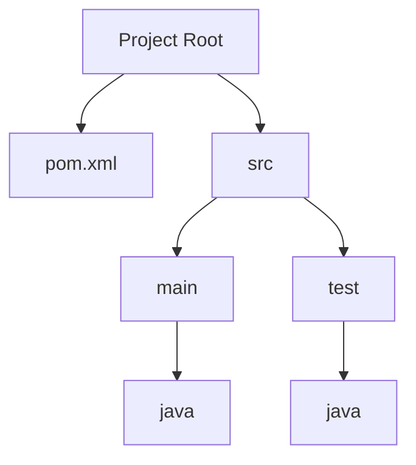
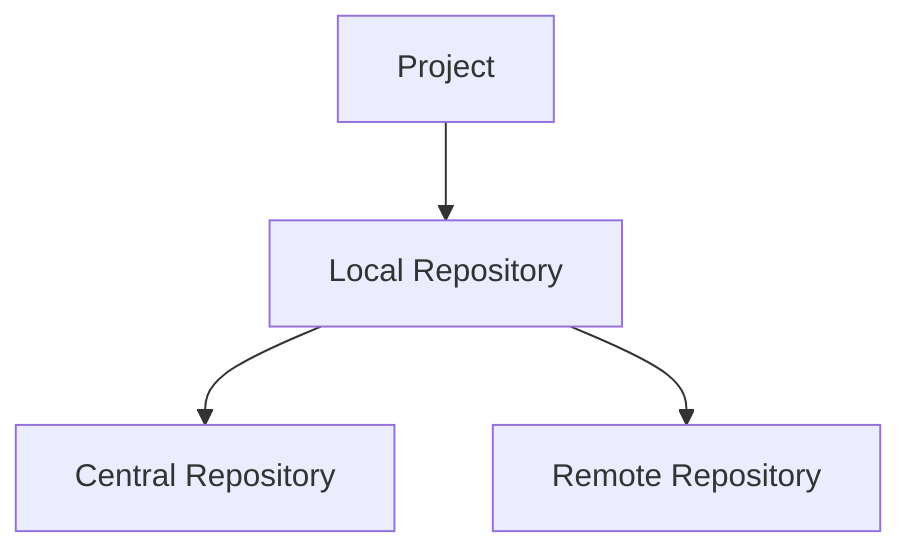
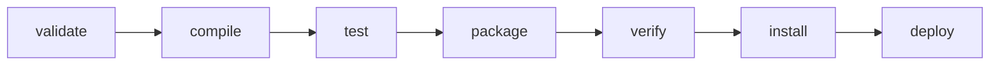
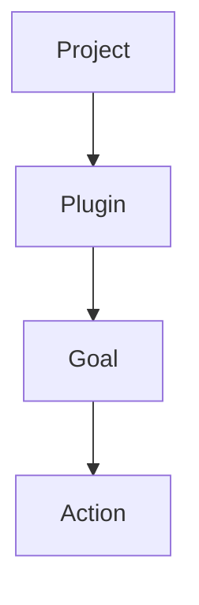
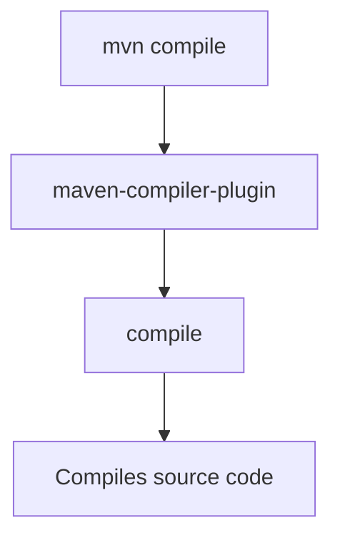
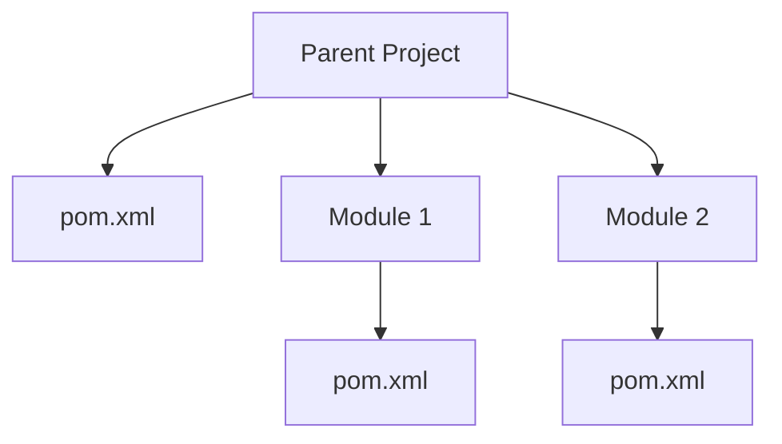
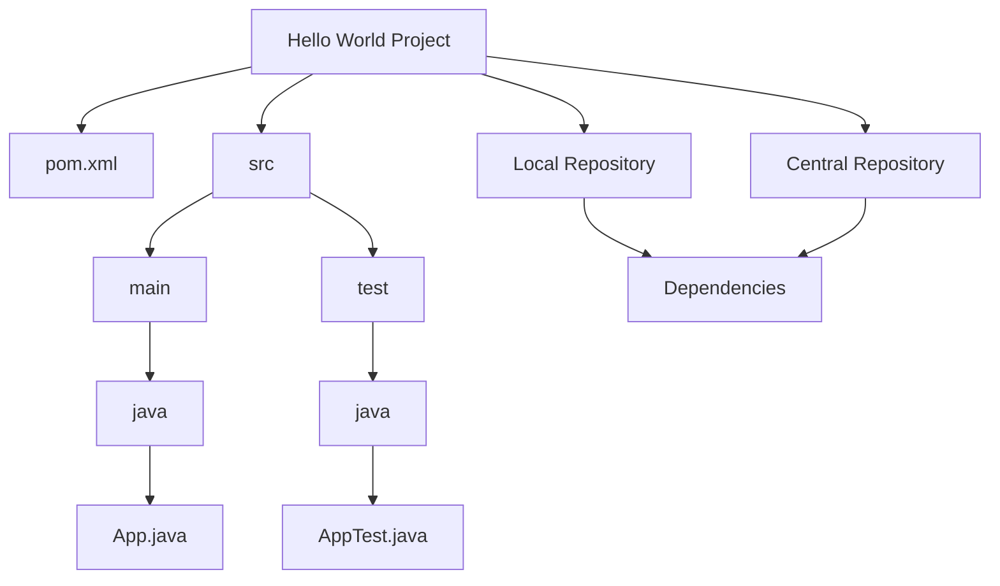

# Maven Notes

## Table of Contents
1. [What & Why of Maven](#what-why-of-maven)
2. [Features](#features)
3. [Hello World of Maven](#hello-world-of-maven)
4. [Internal & External Repositories](#internal-external-repositories)
5. [Maven Lifecycle & Phases](#maven-lifecycle-phases)
6. [Plugins](#plugins)
7. [Maven Commands](#maven-commands)
8. [Building Multiple Projects](#building-multiple-projects)

## What & Why of Maven

**What is Maven?**
- Maven is a build automation and project management tool primarily used for Java projects. It uses a project object model (POM) file to manage a project's build, reporting, and documentation.

**Why use Maven?**
- **Standardization:** Maven provides a standardized build system, which simplifies the project setup and management.
- **Dependency Management:** Maven automatically manages project dependencies, downloading necessary libraries and managing versioning.
- **Consistent Project Structure:** Maven enforces a uniform directory layout, making it easier for developers to navigate projects.
- **Automated Builds:** Maven automates the compilation, testing, packaging, and deployment processes.
- **Extensibility:** Maven is highly extensible through plugins, allowing it to perform a wide range of tasks.

## Features

- **Dependency Management:** Handles transitive dependencies, automatically downloading required libraries.
- **Project Structure:** Enforces a standard project layout, reducing complexity.
- **Build Lifecycle:** Provides a series of build phases, ensuring a consistent build process.
- **Plugins:** Extends functionality through a wide range of plugins.
- **Repository:** Utilizes local, central, and remote repositories to store and retrieve dependencies.
- **Multi-module Projects:** Supports building and managing multiple related projects within a single build.

## Hello World of Maven

### Step-by-step Guide

1. **Install Maven:** Download and install Maven from the [official site](https://maven.apache.org/download.cgi). Ensure `mvn` is in your PATH.
2. **Create a Maven Project:**
   ```sh
   mvn archetype:generate -DgroupId=com.example -DartifactId=helloworld -DarchetypeArtifactId=maven-archetype-quickstart -DinteractiveMode=false
    ```
3. **Project Structure:**

```
helloworld
├── pom.xml
└── src
    ├── main
    │   └── java
    │       └── com
    │           └── example
    │               └── App.java
    └── test
        └── java
            └── com
                └── example
                    └── AppTest.java
```
4. **Edit App.java:**

```java

package com.example;

public class App {
    public static void main(String[] args) {
        System.out.println("Hello, World!");
    }
}
```
5. **Build and Run:**

```sh
cd helloworld
mvn package
java -cp target/helloworld-1.0-SNAPSHOT.jar com.example.App
```

## Project Structure Diagram


## Internal & External Repositories
### Internal Repository
- Located on the local machine.
- Default location: ~/.m2/repository.
- Used to store dependencies that have been downloaded or installed locally.
- External Repository
- Central Repository: Maven's default repository, hosted by the Apache Software Foundation.
- Remote Repositories: Can be configured in pom.xml or settings.xml to use other repositories (e.g., corporate or third-party repositories).
  
### Repository Diagram

## Maven Lifecycle & Phases
### Build Lifecycle
- Maven has three built-in build lifecycles: default, clean, and site.
### Default Lifecycle Phases

### Clean Lifecycle Phases

### Site Lifecycle Phases


## Plugins
- Plugins extend Maven’s core functionality. They can be used to add capabilities like compiling code, packaging binaries, running tests, creating reports, etc.
- Example plugins: maven-compiler-plugin, maven-surefire-plugin, maven-jar-plugin.
### Example Plugin Configuration
```xml
<build>
    <plugins>
        <plugin>
            <groupId>org.apache.maven.plugins</groupId>
            <artifactId>maven-compiler-plugin</artifactId>
            <version>3.8.1</version>
            <configuration>
                <source>1.8</source>
                <target>1.8</target>
            </configuration>
        </plugin>
    </plugins>
</build>
```
### Plugin Usage Diagram

### Example Plugin Execution

## Maven Commands
- mvn clean: Cleans the project, removing target directory.
- mvn compile: Compiles the source code.
- mvn test: Runs the unit tests.
- mvn package: Packages the compiled code into a JAR/WAR.
- mvn install: Installs the package into the local repository.
- mvn deploy: Deploys the package to a remote repository.

## Building Multiple Projects
### Multi-module Projects
- Multi-module projects allow managing multiple interrelated projects within a single build.

### Example Structure
```plaintext
parent-project
├── pom.xml
├── module1
│   └── pom.xml
└── module2
    └── pom.xml
```
### Parent POM
```xml
<project>
    <modelVersion>4.0.0</modelVersion>
    <groupId>com.example</groupId>
    <artifactId>parent-project</artifactId>
    <version>1.0-SNAPSHOT</version>
    <packaging>pom</packaging>
    <modules>
        <module>module1</module>
        <module>module2</module>
    </modules>
</project>
```
### Module POM
```xml
<project>
    <modelVersion>4.0.0</modelVersion>
    <parent>
        <groupId>com.example</groupId>
        <artifactId>parent-project</artifactId>
        <version>1.0-SNAPSHOT</version>
    </parent>
    <artifactId>module1</artifactId>
</project>
```
### Building the Project
```sh
mvn clean install
```
This command will build all modules defined in the parent POM.

### Multi-module Project Diagram

## Maven Hello World Overview


